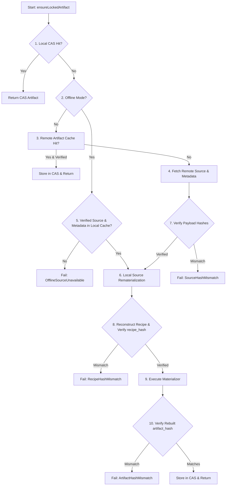

# RFC: Lockfile Replay Contract and Portable Provenance Schema

**Date:** 2026-07-21  
**Project:** Moonstone (`moonstone-sh/moonstone`)  
**Status:** PROPOSED RFC  
**Target File:** `docs/maintenance/lockfile-replay-contract-2026-07-21.md`  

---

## Executive Summary & Mandatory Invariant

This Request for Comments (RFC) defines the formal contract, portable schema, state machine, failure taxonomy, and domain boundaries for deterministic clean-store lockfile replay in Moonstone.

### Architectural Invariant

> **Mandatory Replay Invariant:** `artifact_hash` is the exact identity of the realized output. An artifact produced by rematerialization is valid for lockfile replay **if and only if** its resulting hash matches the locked `artifact_hash` bit-for-bit.

$$\text{Rebuilt Artifact Hash} == \text{Locked Artifact Hash} \implies \text{Replay Succeeded}$$
$$\text{Rebuilt Artifact Hash} \neq \text{Locked Artifact Hash} \implies \text{Replay Failed}$$

Ordinary lockfile replay **shall never** silently accept a different artifact hash and rewrite the lockfile. Accepting a newly produced artifact with a different hash requires an explicit re-lock or update operation.

---

## 1. The Lockfile Replay Contract

When `moon sync` executes in a directory containing an existing `moonstone.lock`:

### Normative Rules

1. **No Version Selection:** Replay **shall not** invoke PubGrub or perform dependency version selection. It **shall** enforce the exact package versions pinned in `moonstone.lock`.
2. **No Silent Lockfile Mutation:** Ordinary replay **shall not** modify `moonstone.lock`. If replay fails, `moonstone.lock` **shall** remain unchanged.
3. **No Resolver Queries:** Replay **shall not** query package resolvers (`rocks:`, `moonstone:`) for new metadata or version discovery.
4. **Exact Payload Verification:** Every retrieved payload (source archive, rockspec, or pre-built artifact) **must** be verified against its locked BLAKE3 content hash before use.
5. **Exact Recipe & Artifact Invariance:** Rematerialization is valid only when the reconstructed recipe matches `recipe_hash` and the resulting output directory matches `artifact_hash`.
6. **Strict Runtime Identity:** Replay **shall not** substitute a runtime with a different `runtime_hash`, even if it possesses a compatible Lua ABI (`lua_abi`).
7. **Offline Replay Mode (`--offline`):** Offline mode disables network access, **not** local rematerialization. Replay in offline mode **shall** succeed if all required source/metadata payloads or pre-built artifacts exist in local caches.
8. **Concrete Target Enforcement:** Replay **shall** verify that the locked target triple matches the host environment. Rematerialization for a foreign target triple **shall** be prohibited.

---

## 2. Recipe Preimage & Field Canonicalization

In `src/core/store.zig:computeRecipeHash`, the production recipe preimage string is formatted as:

```text
moonstone:recipe:v2
kind={kind}
name={name}
version={version}
source_hash={source_hash}
materializer={materializer}
strategy={strategy}
zig_version={zig_version}
cmake_version={cmake_version}
ldflags={ldflags}
runtime_hash={runtime_hash}
lua_abi={lua_abi}
target={target}
sources={sources}
output_module={output_module}
output_path={output_path}
collect={collect}
build_env={build_env}
```

### Complete Field Specification & Normalization Rules

| Field Name | TOML Type | Order Sensitive? | Canonical Empty Value | Normalization Rules & Path Scope | Replay Source |
| :--- | :--- | :---: | :---: | :--- | :--- |
| `kind` | String | N/A | `"lib"` | Lowercase string (`"script"`, `"lib"`, `"bin"`, `"runtime"`) | `[package].kind` |
| `name` | String | N/A | `""` | Lowercase canonical package name | `[package].name` |
| `version` | String | N/A | `""` | Canonical SemVer string | `[package].version` |
| `source_hash` | String | N/A | `""` | Lowercase BLAKE3 hex (`b3:...`) of raw source archive bytes | `[package.source].hash` |
| `materializer` | String | N/A | `""` | Materializer kind string (`"builtin"`, `"luarocks_src_rock"`) | `[package.recipe].materializer` |
| `strategy` | String | N/A | `""` | Build strategy (`"pure-lua"`, `"make"`, `"cmake"`) | `[package.recipe].strategy` |
| `zig_version` | String | N/A | `""` | Exact SemVer string of Zig toolchain (e.g. `"0.13.0"`) | `[package.recipe].zig_version` |
| `cmake_version` | String | N/A | `""` | Exact SemVer string of CMake toolchain | `[package.recipe].cmake_version` |
| `ldflags` | Array of Strings | Yes | `[]` | Sorted array of linker flags; machine paths prohibited | `[package.recipe].ldflags` |
| `runtime_hash` | String | N/A | `""` | BLAKE3 artifact hash of locked Lua runtime interpreter | `[package.recipe].runtime_hash` |
| `lua_abi` | String | N/A | `""` | Lua ABI version string (`"5.4"`, `"5.1"`) | `[package.recipe].lua_abi` |
| `target` | String | N/A | `""` | Fully qualified LLVM target triple (e.g. `"aarch64-macos"`) | `[package.recipe].target` |
| `sources` | Array of Strings | Yes | `[]` | Sorted package-relative C file paths (`src/foo.c`) | `[package.recipe].sources` |
| `output_module` | String | N/A | `""` | Derived module identifier | Derived from `name` |
| `output_path` | String | N/A | `""` | Derived output path | Derived from `name` |
| `collect` | Array of Strings | Yes | `[]` | Formatted install rules (`"mod:inspect:inspect.lua"`) | Derived from rockspec |
| `build_env` | Array of Strings | Yes | `[]` | Lexicographically sorted `KEY=VALUE` pairs | `[package.recipe].build_env` |

---

## 3. Schema Versioning & Compatibility Identifiers

To prevent silent misinterpretation across Moonstone versions, lockfiles and recipes include explicit schema identifiers:

```toml
[package.schema]
lockfile_version = 1
recipe_schema = "moonstone:recipe:v2"
materializer_schema = "moonstone:builtin:v1"
artifact_schema = "moonstone:artifact-tree:v1"
source_schema = "moonstone:archive-blake3:v1"
```

- **`lockfile_version = 1`**: Indicates complete replay provenance is embedded in the entry.
- **`recipe_schema = "moonstone:recipe:v2"`**: Binds recipe hash computation to the 17-field preimage format.
- **`artifact_schema = "moonstone:artifact-tree:v1"`**: Binds artifact directory hashing to BLAKE3 sorted-entry tree hashing.

---

## 4. Portable Replay-Provenance Schema (`moonstone.lock` v1)

```toml
version = 1

[[package]]
name = "inspect"
version = "3.1.3-0"
kind = "lib"
resolver = "rocks"
reproducible = true

source_hash = "b3:17e264ebf50f518cf29ffd6d1027d2aeefc1ff030568de02a260e7dc6701198a"
recipe_hash = "b3:4a78759c85d24ed4ee0ec6da5c88c06d6f88b46f35e29e5a5e770f160d6beb72"
artifact_hash = "b3:5ac9feaa83ddf51cad9d0f25e20bbf37aede1dd2f5679e5d6f735c62819444bb"

[package.schema]
lockfile_version = 1
recipe_schema = "moonstone:recipe:v2"
materializer_schema = "moonstone:builtin:v1"
artifact_schema = "moonstone:artifact-tree:v1"
source_schema = "moonstone:archive-blake3:v1"

[package.source]
kind = "upstream_archive"
url = "https://github.com/kikito/inspect.lua/archive/v3.1.3.tar.gz"
hash = "b3:17e264ebf50f518cf29ffd6d1027d2aeefc1ff030568de02a260e7dc6701198a"
mirrors = [
  "https://luarocks.org/manifests/kikito/inspect-3.1.3-0.src.rock"
]

[package.metadata.rockspec]
url = "https://luarocks.org/inspect-3.1.3-0.rockspec"
hash = "b3:4c0a1985672bd26ff65991837e224c50c0b506ace448df40f4e09cbb49149c99"

[package.recipe]
materializer = "builtin"
strategy = "pure-lua"
runtime = "5.4"
lua_abi = "5.4"
target = "aarch64-macos"
runtime_hash = "b3:8f2a1104e762c..."
zig_version = ""
cmake_version = ""
ldflags = []
sources = []
build_env = []
```

---

## 5. Source Identity Definition

In production Moonstone code (`src/core/resolution/sources/luarocks.zig` & `src/core/materialization/materializer.zig`), **`source_hash` is strictly defined as**:

> **Source Identity:** The BLAKE3 cryptographic hash of the raw, compressed source archive file bytes (`.tar.gz`, `.zip`, `.src.rock`) as downloaded over the wire.

It is **not** the unpacked filesystem directory tree hash.

---

## 6. Separation of Concepts & Terminology

| Concept | Domain Meaning | Example Values | Location |
| :--- | :--- | :--- | :--- |
| **`origin_resolver`** | Protocol/ecosystem where package semantics originated | `rocks`, `moonstone`, `link`, `path` | `LockEntry.resolver` |
| **`immutable_payload_provider`** | Service/cache supplying verified source/metadata bytes | `luarocks_cdn`, `github_archive`, `local_cache` | Internal realizer |
| **`artifact_provider`** | Store/registry supplying pre-built binary artifacts | `local_cas`, `remote_artifact_cache` | Internal realizer |
| **`realization_method`** | Mechanism used to project artifact into environment | `local_cas_hit`, `remote_artifact_fetch`, `source_rematerialization` | Progress events & audit log |

---

## 7. Concrete Target Identity Enforcement

- **`target` Field:** `LockEntry.target` **must** store a concrete LLVM target triple (e.g. `aarch64-macos`, `x86_64-linux-gnu`, `x86_64-windows-msvc`). Context-sensitive tokens like `"native"` are prohibited in serialized v1 lockfiles.
- **Host Compatibility Check:** Before attempting materialization, the realizer verifies `target == host_target_triple`. If they differ, materialization aborts with `TargetIncompatible`.
- **Cross-Target Replay:** Cross-target artifact retrieval is allowed **only** if the target is compatible with the host interpreter runtime.

---

## 8. Bounded `build_env` Security & Normalization

To prevent environment contamination or credential leaks:
1. **Explicit Whitelist:** Only environment variables explicitly declared in the package rockspec/recipe (e.g. `LUA_INCDIR`, `CFLAGS`) enter `build_env`.
2. **Ambient Stripping:** Ambient process environment variables (`PATH`, `USER`, `SSH_AUTH_SOCK`, `AUTH_TOKEN`) are strictly stripped.
3. **Lexicographical Sorting:** `build_env` is serialized as an array of lexicographically sorted `KEY=VALUE` strings.

---

## 9. Offline Replay State Machine



---

## 10. Native Package Policy (First Replay Version)

For initial implementation:

- **Pure-Lua Packages (`rocks:inspect`, `rocks:dkjson`):** Supported for both remote pre-built artifact retrieval and local source rematerialization.
- **Native C Packages (`rocks:lua-cjson`, `rocks:lpeg`):** Supported **only** via local CAS or exact remote pre-built artifact retrieval (`artifact_hash`).
- **Native Store Miss:** If a native C package experiences a local CAS miss and no remote pre-built artifact is found, the realizer returns `ToolchainReplayUnsupported`.

### Prerequisites for Future Native Source Rematerialization
1. Hermetic C compiler & linker toolchain binding (e.g. Moonstone-managed Zig compiler).
2. Pinned platform SDK headers & libc identity.
3. Deterministic C object compilation flags.

---

## 11. Domain Boundary Architecture (`locked_realizer.zig`)

Location: `src/core/resolution/locked_realizer.zig`

```zig
pub const ReplayPolicy = struct {
    offline: bool = false,
    allow_remote_artifacts: bool = true,
    allow_source_rematerialization: bool = true,
};

pub const RealizeResult = struct {
    candidate: candidate_mod.Candidate,
    provider: RealizationProvider,
};

pub fn ensureLockedArtifact(
    allocator: std.mem.Allocator,
    io: std.Io,
    env: *std.process.Environ.Map,
    entry: *const lockfile.LockEntry,
    provider: *package_provider.PackageProvider,
    store: *store_driver.StoreDriver,
    policy: ReplayPolicy,
) !RealizeResult;
```

---

## 12. Failure Taxonomy & Diagnostics

| Failure Name | JSON Error Identifier | Network Fixable? | Lockfile Valid? | Description |
| :--- | :--- | :---: | :---: | :--- |
| `LockedArtifactMissing` | `error.LockedArtifactMissing` | Yes | Yes | Artifact missing locally and remote fetch disabled |
| `RemoteArtifactUnavailable` | `error.RemoteArtifactUnavailable` | Yes | Yes | Pre-built artifact not found on remote registry |
| `RemoteArtifactUnauthorized` | `error.RemoteArtifactUnauthorized` | Yes | Yes | HTTP 401/403 when requesting remote artifact |
| `RemoteArtifactHashMismatch` | `error.RemoteArtifactHashMismatch` | No | Yes | Downloaded artifact hash differs from `artifact_hash` |
| `ReplayProvenanceMissing` | `error.ReplayProvenanceMissing` | No | No | Lock entry lacks source/metadata descriptors |
| `SourceUnavailable` | `error.SourceUnavailable` | Yes | Yes | Failed to download source archive |
| `SourceUnauthorized` | `error.SourceUnauthorized` | Yes | Yes | HTTP 401/403 when requesting source archive |
| `SourceHashMismatch` | `error.SourceHashMismatch` | No | Yes | Downloaded source hash differs from `source_hash` |
| `MetadataUnavailable` | `error.MetadataUnavailable` | Yes | Yes | Failed to download rockspec metadata |
| `MetadataHashMismatch` | `error.MetadataHashMismatch` | No | Yes | Downloaded rockspec hash differs from `rockspec_hash` |
| `RecipeSchemaUnsupported` | `error.RecipeSchemaUnsupported` | No | No | Recipe schema version unknown by Moonstone |
| `RecipeHashMismatch` | `error.RecipeHashMismatch` | No | Yes | Reconstructed recipe hash differs from `recipe_hash` |
| `RuntimeArtifactUnavailable`| `error.RuntimeArtifactUnavailable`| Yes | Yes | Locked runtime binary artifact missing |
| `RuntimeArtifactMismatch` | `error.RuntimeArtifactMismatch` | No | Yes | Active runtime hash differs from `runtime_hash` |
| `ToolchainReplayUnsupported` | `error.ToolchainReplayUnsupported` | No | Yes | Native rematerialization not yet supported |
| `TargetIncompatible` | `error.TargetIncompatible` | No | Yes | Locked target triple incompatible with host |
| `OfflineArtifactUnavailable`| `error.OfflineArtifactUnavailable`| Yes | Yes | Artifact missing locally while `--offline` set |
| `OfflineSourceUnavailable` | `error.OfflineSourceUnavailable` | Yes | Yes | Source payload missing locally while `--offline` set |
| `OfflineMetadataUnavailable` | `error.OfflineMetadataUnavailable` | Yes | Yes | Rockspec missing locally while `--offline` set |
| `ArtifactHashMismatch` | `error.ArtifactHashMismatch` | No | Yes | Rebuilt artifact hash differs from `artifact_hash` |
| `LegacyLockNotRematerializable` | `error.LegacyLockNotRematerializable` | No | No | Lockfile v0 cannot be rematerialized on clean store |

---

## 13. Test Strategy & Isolated Test Plan

Tests **must** use temporary directory paths (`MOONSTONE_HOME`, `MOONSTONE_CONFIG`, `MOONSTONE_DATA`, `MOONSTONE_CACHE`) to avoid touching developer state.

### E2E Test Fixtures
- Pure-Lua package fixtures: `rocks:inspect` or `rocks:dkjson`. (Note: `LuaFileSystem` is a native C package and **must not** be used as a pure-Lua fixture).

### Test Matrix (`tests/e2e/sync/clean_store_replay_matrix.sh`)

1. **Clean Store + Network Replay:** Wipe CAS, run sync, assert byte-for-byte lockfile match & execution success.
2. **Clean Store + Cached Source:** Wipe CAS (keep source cache), run sync `--offline`, assert successful rematerialization.
3. **Offline Store Miss:** Wipe CAS & source cache, run sync `--offline`, assert `OfflineSourceUnavailable`.
4. **Source Hash Mismatch:** Corrupt cached source tarball, run sync, assert `SourceHashMismatch`.
5. **Artifact Hash Mismatch:** Inject modified file during materialization, assert `ArtifactHashMismatch`.

---

## 14. Implementation Roadmap (Phases A–J)

- **Phase A — Schema & Compatibility Types:** Define `LockEntry` v1 schema and schema identifiers (`recipe_schema`).
- **Phase B — Origin Resolver Preservation:** Fix `pkg.origin` mapping so `resolver = "rocks"` is preserved in lockfiles.
- **Phase C — Locked Realizer Domain Boundary:** Implement `ensureLockedArtifact` in `src/core/resolution/locked_realizer.zig` with local CAS lookup.
- **Phase D — Verified Local Payload Recovery:** Implement local source/metadata payload cache retrieval.
- **Phase E — Verified Network Recovery:** Implement downloading source and rockspec payloads over HTTP with BLAKE3 verification.
- **Phase F — Pure-Lua Rematerialization:** Wire `materializer.zig` for pure-Lua extraction & copy routines.
- **Phase G — Strict Recipe & Artifact Verification:** Enforce `recipe_hash` and `artifact_hash` bit-for-bit equality checks.
- **Phase H — E2E Test Matrix:** Add isolated e2e tests for pure-Lua clean store and offline replay scenarios.
- **Phase I — Remote Exact-Artifact Provider Integration:** Add optional remote artifact proxy client.
- **Phase J — Native Replay Research:** Investigate hermetic toolchain bindings for native C rematerialization.
